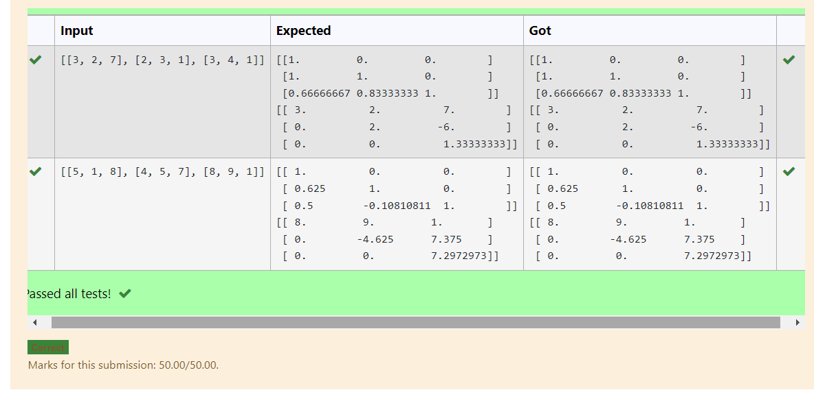

# LU Decomposition 

## AIM:
To write a program to find the LU Decomposition of a matrix.

## Equipments Required:
1. Hardware – PCs
2. Anaconda – Python 3.7 Installation / Moodle-Code Runner

## Algorithm
1. Import the numpy as np
2. Import LU from Scipy   
3. Find L,U
4. Solve for with LU  
5.Print the solved matix

## Program:
(i) To find the L and U matrix
```
/*
Program to find the L and U matrix.
Developed by: S Dhanush Praboo  
RegisterNumber: 21500206
*/
import numpy as np
from scipy.linalg import lu
A=np.array(eval(input()))
P,L,U=lu(A)
print(L)
print(U)
```
(ii) To find the LU Decomposition of a matrix
```
/*
Program to find the LU Decomposition of a matrix.
Developed by: S Dhanush Praboo
RegisterNumber: 21500206
*/
from scipy.linalg import lu_factor,lu_solve
A=eval(input())
b=eval(input())
lu,piv=lu_factor(A)
x=lu_solve((lu,piv),b)
print(x)
```

## Output:



## Result:
Thus the program to find the LU Decomposition of a matrix is written and verified using python programming.

